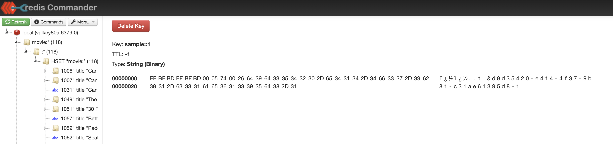

Spring Boot Data Redis - example with Redis and Valkey
=

The purpose of this repository is to check that Valkey works fine with Spring Data Redis as a drop-in replacement.

Following versions of Redis and Valkey are covered in this sample project:

| Storage | Version | Docker image                     |
|---------|---------|----------------------------------|
| Redis   | 7.2     | `redis:7.2.7-alpine3.21`         |
| Redis   | 7.4     | `redis:7.4.2-alpine3.21`         |
| Valkey  | 7.2     | `valkey/valkey:7.2.8-alpine3.21` |
| Valkey  | 8.0     | `valkey/valkey:8.0.2-alpine3.21` |

## Project Overview

This project demonstrates the use of Spring Boot with Spring Data Redis and Valkey as a caching solution. It includes a simple service that caches values using Redis or Valkey, and a REST controller to interact with the service.

### Components

- **Application Class**: The main entry point of the application is [`RedisAndValkeySampleApplication`](src/main/java/dev/starichkov/java/spring/valkey/RedisAndValkeySampleApplication.java).
- **Service Class**: The service class [`SampleServiceWithCaching`](src/main/java/dev/starichkov/java/spring/valkey/SampleServiceWithCaching.java) provides methods to get and delete cached values.
- **Controller Class**: The controller class [`SampleController`](src/main/java/dev/starichkov/java/spring/valkey/SampleController.java) exposes REST endpoints to interact with the service.

### How It Works

1. **Caching**: The `SampleServiceWithCaching` class uses Spring's `@Cacheable` and `@CacheEvict` annotations to cache values and evict them from the cache.
2. **REST Endpoints**: The `SampleController` class exposes two endpoints:
   - `GET /sample/{key}`: Retrieves the cached value for the given key.
   - `DELETE /sample/{key}`: Deletes the cached value for the given key.
3. **Integration with Valkey**: The project includes test classes to verify the integration with different versions of Redis and Valkey using Testcontainers.

### Valkey and Redis Commander
##### Create a docker network
```
docker network create valkey-net
```
##### Run valkey docker image on same netowrk
```
docker run -d --name valkey80a  --network=valkey-net   -p 6379:6379  valkey/valkey:8.0.2-alpine3.21
```
##### Run redis commander on same netowrk
```
docker run -d -p 8081:8081 --name redis-commander --network valkey-net -e REDIS_HOSTS=local:valkey80a:6379 rediscommander/redis-commander
```


## Building and Running the Project

To compile and run the project, use the following commands:

```sh
./mvnw clean install
./mvnw spring-boot:run
```

## Exposed Endpoints

Once the application is running, you can interact with the exposed endpoints using `curl` or any HTTP client.

### Get Cached Value

```sh
curl -X GET http://localhost:8080/sample/{key}
```

Replace `{key}` with the actual key you want to retrieve.

### Delete Cached Value

```sh
curl -X DELETE http://localhost:8080/sample/{key}
```

Replace `{key}` with the actual key you want to delete.

### Query movies dataset
```
curl -X GET http://localhost:8080/movies
```



## Docker Containers

### Redis

#### 7.2

```shell
docker run -d --name redis72a \
  --network=localnet \
  -p 6379:6379 \
  redis:7.2.7-alpine3.21
```

#### 7.4

```shell
docker run -d --name redis74a \
  --network=localnet \
  -p 6379:6379 \
  redis:7.4.2-alpine3.21
```

### Valkey

#### 7.2

```shell
docker run -d --name valkey72a \
  --network=localnet \
  -p 6379:6379 \
  valkey/valkey:7.2.8-alpine3.21
```

#### 8.0

```shell
docker run -d --name valkey80a \
  --network=localnet \
  -p 6379:6379 \
  valkey/valkey:8.0.2-alpine3.21
```